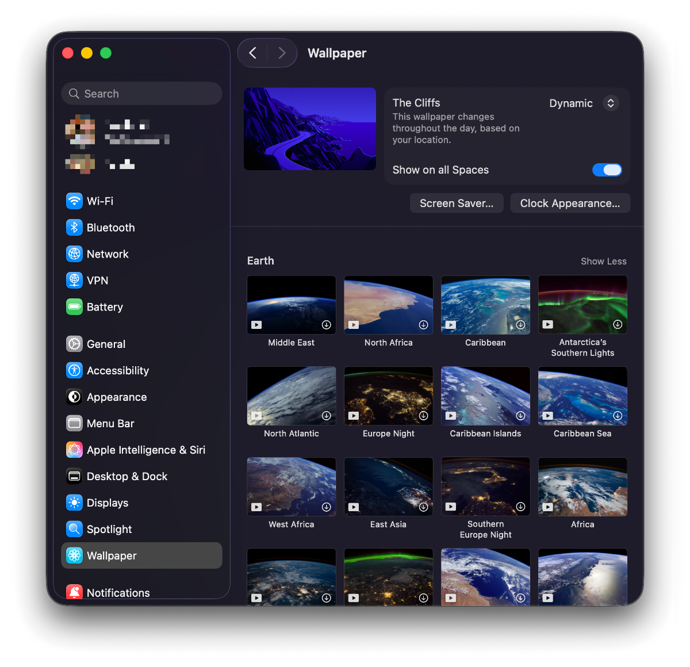
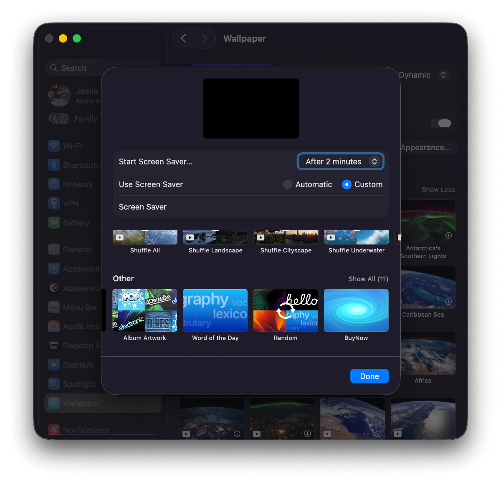

# BUY NOW Screensaver

A macOS recreation of the classic **BUY NOW** screensaver by [Ficus Kirkpatrick](http://toastycode.com/besavers/) for BeOS.

Original screensaver from the BeOS screensaver collection. This is a tribute to [BeOS](https://en.wikipedia.org/wiki/BeOS), the multithreaded operating system developed by Be Inc. in the 1990s.


## Features

- Dark blue background with white "BUY NOW" text
- Flashes on/off every second
- Native macOS screensaver (.saver bundle)

## Installation

### Download

**Quick install:** [Download Buy Now.saver.zip](https://github.com/yourusername/buy-now/releases) _(coming soon)_

**Mac App Store:** _Coming soon_

### How to Install

1. Double-click `Buy Now.saver` (or download from Mac App Store when available)
2. Open **System Settings**
3. Go to **Wallpapers**
4. Click the **Screen Saver** button at the bottom
5. Scroll to the bottom right to find **Buy Now**
6. Click to select it




### Build from Source

```bash
git clone https://github.com/yourusername/buy-now.git
cd buy-now
./build.sh
open "Buy Now.saver"
```

Then follow the installation steps above.

## Distribution

### For GitHub Releases

```bash
# Build everything
./build.sh
./build-app.sh
./package-app.sh
```

This creates:
- `Buy-Now-screensaver.zip` - Screensaver only (13KB)
- `Buy-Now-App.zip` - Mac app wrapper
- `Buy-Now-Screensaver-Installer.dmg` - Installer disk image

### For Mac App Store

The app in `BuyNowApp/` can be submitted to the Mac App Store:
1. Add proper code signing
2. Add app icon assets
3. Submit via Xcode or `xcrun altool`

See [Mac App Store submission guide](https://developer.apple.com/app-store/submitting/) for details.

## Credits

Original screensaver by [Ficus Kirkpatrick](http://toastycode.com/besavers/) for BeOS.

## Video Version

A video version (`buy-now.mp4`) is also included for use with video-based screensavers or just for vibes.

### Regenerating the Video

To create a new version with different duration or settings:

```bash
ffmpeg -f lavfi -i color=c=0x00008B:s=1920x1080:d=10 \
  -vf "drawtext=text='BUY':fontcolor=white:fontsize=180:font='Arial Bold':x=(w-text_w)/2:y=(h-text_h)/2-100:enable='mod(floor(t),2)',\
       drawtext=text='NOW':fontcolor=white:fontsize=180:font='Arial Bold':x=(w-text_w)/2:y=(h-text_h)/2+100:enable='mod(floor(t),2)'" \
  -c:v libx264 -pix_fmt yuv420p -r 30 -y buy-now.mp4
```

Parameters:
- `d=10` - duration in seconds
- `s=1920x1080` - resolution
- `c=0x00008B` - dark blue color (matching BeOS original)
- `fontsize=180` - text size
- Two-line layout with "BUY" and "NOW" stacked
- `enable='mod(floor(t),2)'` - flashing logic (on during even seconds, off during odd)
